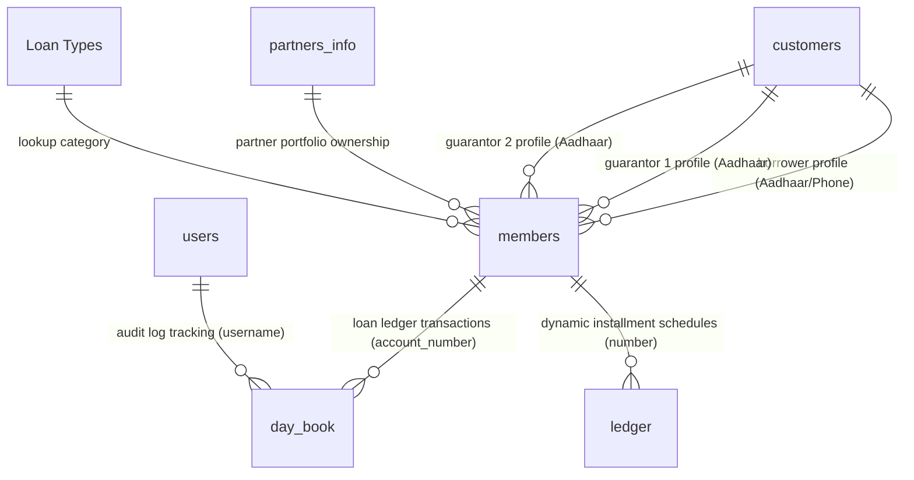

# Legacy MS Access Finance System Audit & Migration Report

## Executive Summary
This report presents a comprehensive forensic audit of the legacy Microsoft Access database (`Finance.accdb`) and compares its business rules against the new React/Supabase implementation located in `/Users/karthikmac/Documents/ThirumalaGroup-thirumala`.

The legacy system is a mature, fully featured lending and collections management system handling multiple loan types: **CD Loans (Maturity Loans)**, **STBD (Short Term Business Loans)**, **HP (Hire Purchase Loans)**, and **TBD (Ten Book Daily Loans)**. It features automated daily interest accruals, complex tiered penalty structures, interest-based renewal extensions, principal reduction tracking, and legal document control.

### Critical Discovery
> [!IMPORTANT]
> The current Supabase/React system **only implements the general cash book/daily ledger** (`cash_book`, `companies`, `company_main_accounts` tables). 
> 
> **Zero percent (0%) of the lending modules (Customers, Active Loans, Interest Calculators, Overdue/Penalty Engines, NPA Workflows, and Document Controls) have been implemented in the new system.** The tables `members`, `customers`, and `ledger` from the legacy database have no counterparts in the new database. To complete the migration, the tables, schema wrappers, UI forms, and VBA-based calculations documented below must be fully built in Supabase and React.

---

## Phase 1: Database Discovery
A full scan of the tables, record counts, and database properties was conducted using the `mdbtools` suite.

### Table Statistics & Purpose
| Table Name | Record Count | Primary Key | Purpose / Contents | Related Tables |
| :--- | :--- | :--- | :--- | :--- |
| **`customers`** | 352 | `id` (Auto) | Master borrower profiles (Aadhaar, address, phone). | `members` (Guarantor / Borrower links) |
| **`members`** | 527 | `number` | Master active loan accounts (Balances, rates, terms, guarantors). | `customers`, `day_book` |
| **`day_book`** | 7110 | `id` (Auto) | Central transaction ledger (Cash debits/credits against loans). | `members.number` |
| **`ledger`** | 5 | None | Temporary/dynamic schedule details for monthly HP/STBD installments. | `members.number` |
| **`Loan Types`** | 4 | `id` (Auto) | Lookup for loan categories (`STBD`, `CD`, `TBD`, `HP`). | `members.loantype` |
| **`Account_types`**| 7 | `account_type` | Financial classification lookup (`Capital`, `Loans`, `Bank`, `In`, `Out`).| `accounts` |
| **`accounts`** | 59 | `account_name` | Chart of general ledger accounts. | `day_book` |
| **`partners_info`**| 3 | `partnername` | Partner shares, MD status, phone numbers, and share numbers. | `members.partner` |
| **`users`** | 2 | `username` | Access credentials and authorization levels. | `day_book.username` |
| **`Years`** | 91 | `myyear` | Date-selector helper lookup. | None |
| **`Months`** | 12 | `mymonth` | Date-selector helper lookup. | None |
| **`Dates`** | 31 | `mydate` | Date-selector helper lookup. | None |
| **`Edited Members`**| 433 | `id` (Auto) | Audit log for changes made to borrower records. | `members` |
| **`Deleted Daybook`**| 819 | `id` (Auto) | Audit log for deleted transaction lines. | `day_book` |
| **`Deleted Members`**| 6 | `id` (Auto) | Audit log for deleted borrower profiles. | `members` |
| **`Partners_info`**| 3 | `partnername` | Personal share and personal information for partners. | None |
| **`User2`** | 1 | None | Supplemental security settings. | None |
| **`Usertypes`** | 2 | `id` (Auto) | User role permissions (`Admin`, `User`). | `users` |
| **`Backup`** | 400 | `id` (Auto) | Log of database backup file executions. | None |
| **`ALL`** | 0 | `account_name` | Temporary scratch table for query filtering. | None |

### Hidden and System Tables
The database contains MS Access interface metadata and object lists stored in the following system tables:
* `MSysObjects`: Catalog of all tables, queries, forms, modules, and reports.
* `MSysQueries`: Binary structural mapping of Access queries.
* `MSysRelationships`: Database-level relationships (only 1 exists: `MSysNavPaneGroupCategories` to `MSysNavPaneGroups`—custom business table relationships are enforced in VBA/forms rather than at the database constraint level).
* `MSysAccessStorage` & `MSysResources`: Tree storage where forms, reports, and compiled VBA projects are serialized.

---

## Phase 2: Finance Module Identification
The entity relationships in the legacy system are defined dynamically at the application level through forms and queries rather than hard foreign keys. 

### Logical Data Flow Diagram


### Table Roles & Interactions
1. **Customer Profiling:** When a borrower is selected, the system queries `customers` by `cadhaar` to fetch `cno`. Personal and address strings are copied to the new loan record.
2. **Guarantor Tracking:** Up to 2 guarantors are linked. The system fetches their names and phones from `customers` based on the inputs in `gadhaar1` and `gadhaar2`, storing them directly in `members` columns.
3. **Transaction Ledgers:** Every credit payment or debit disbursement is written to `day_book`. The field `account_number` links the transaction to `members.number` (using prefix codes like `CD-17` or `HP-5`).
4. **Calculated Summaries:** A background update script (`Updating Due List New.vba`) runs query-aggregations on `day_book` credits to write totals back to `members` (`OnlypremiumPaid`, `PaidAmount`, `DueDate`).

---

## Phase 3: Business Rule Extraction
The business calculations were reverse-engineered directly from the decompressed VBA source code of the active forms and update routines.

### 1. Due Days Calculation
* **Formula:**
  $$\text{DueDays} = \text{CurrentDate} - \text{DueDate}$$
* **Source:** `Form_CD LEDGER.vba` (Line 52) and `Updating Due List New.vba` (Line 214).
* **Details:** `DueDate` is retrieved from `members.duedate`. If `duedate` is null, it defaults to the loan creation date `Date` (`members.date`).
  ```vba
  DueDate = DLookup("[duedate]", "members", "[number] = Forms![CD ledger]!mnumber")
  If IsNull(DueDate) Then DueDate = JDate
  DueDays = [Forms]![RunningUser]![CurrentDate] - DueDate
  ```

### 2. Interest Calculation (CD Loans)
* **Formula:**
  $$\text{AccruedInterest} = \frac{\text{Balancewith} \times \text{Rate} \times \text{DueDays}}{100 \times 30}$$
  *(Rate is monthly interest rate; daily rate is $\text{Rate} / 30$)*
* **Source:** `Form_CD LEDGER.vba` (Line 69) and `Form_CD LEDGER1.vba` (Line 67).
* **Details:** If `DueDays <= 0`, interest defaults to 0. Interest paying for renewals is computed over `RDAYS` (renewal days entered):
  $$\text{InterestPaying} = \frac{\text{Balancewith} \times \text{Rate} \times \text{RDAYS}}{3000}$$

### 3. Penalty Calculation (CD Loans)
* **Formula:**
  $$\text{Penalty} = \begin{cases} 
  0 & \text{if } \text{DueDays} \le 5 \\
  \frac{\text{Balancewith} \times 0.75 \times \text{pDAYS}}{100 \times 30} & \text{if } \text{DueDays} > 5
  \end{cases}$$
  $$\text{where } \text{pDAYS} = \min(\text{DueDays}, \text{RDAYS})$$
* **Source:** `Form_CD LEDGER.vba` (Lines 66-72, 492-494).
* **Details:** Overdue loans are given a 5-day grace period. If past 5 days, a penalty rate of **0.75% per month** (calculated daily as $0.75 / 30 = 0.025\%$ per day) is charged on the outstanding principal balance (`Balancewith` / `Balancewithout`).
* **Note on Cap:** If the client is paying for `RDAYS` days, they only pay penalty up to `pDAYS = min(DueDays, RDAYS)`. They do not pay penalty on advanced prepaid days.

### 4. Penalty Calculation (HP / Monthly Installment Loans)
* **Formula:**
  $$\text{Penalty} = \text{InstallmentAmount} \times 0.002 \times \text{DueDays}$$
  $$\text{for each installment overdue } > 5 \text{ days}$$
* **Source:** `Form_HP ledger1.vba` (Lines 141-149, 305).
* **Details:** HP (Hire Purchase) and STBD (Short Term Business) loans charge a penalty of **0.2% per day of delay** on the *entire monthly installment amount* for each installment that is late by more than 5 days.
  ```vba
  For i = 1 To PayableInstNo
    Myduedate = DateAdd("m", i + !Ipaid, !Date)
    DueDays = Date - Myduedate
    If DueDays > 5 Then
      Penalty = Round(Penalty + !InstallmentAmount * 0.002 * DueDays, 0)
    End If
  Next
  ```

### 5. Renewal Logic (CD Loans)
* **Formula:**
  $$\text{NextDueDate} = \text{DueDate} + \text{RDAYS}$$
  *(Principal remains unchanged; client pays only accrued interest & penalties)*
* **Source:** `Form_CD LEDGER.vba` (Lines 383-388) and `Updating Due List New.vba` (Line 133).
* **Details:**
  - When a renewal occurs, a transaction is added to `Day_Book` under `Head_of_a/c = "CD Commission A/c"` with the new `NextDueDate`.
  - The calculation background loop `FU2` matches the transaction, intercepts the `CD Commission A/c` type, and sets `members.duedate = transaction.DueDate`.
  - The principal outstanding (`Balancewith`) remains constant. The calculation cycle resets to start accruing interest from the new `DueDate`.

### 6. Partial Payment & Principal Reduction Logic
* **Formula:**
  $$\text{NewOutstandingPrincipal} = \text{OriginalAmount} - \sum \text{PrincipalPayments}$$
* **Source:** `Updating Due List New.vba` (Lines 134-140) and `Form_CD LEDGER1.vba` (Lines 153-156).
* **Details:**
  - Principal payments are entered into `Day_Book` with `Head_of_a/c = "CD A/c"`.
  - `FU2` aggregates the sum of credits into `members.OnlypremiumPaid`.
  - `FU3` recalculates the outstanding balances:
    $$\text{members.Balancewithout} = \text{members.Amount} - \text{members.OnlypremiumPaid}$$
    $$\text{members.Balancewith} = \text{members.Amount} - \text{members.OnlypremiumPaid}$$
  - Future daily interest is computed on the reduced principal `Balancewithout`, providing a **declining-balance interest calculation**.

### 7. NPA Closure Logic
* **Formula:**
  $$\text{NPAWriteOffAmount} = \text{Balancewith} + \text{Interest} + \text{Penalty}$$
* **Source:** `Form_CD LEDGER.vba` (Lines 102-220, `Command217_Click`).
* **Details:**
  - When an account goes into default and is written off as Non-Performing Asset (NPA):
  - A Debit of the full amount ($\text{Balancewith} + \text{Interest} + \text{Penalty}$) is posted to `"NPA A/C"`.
  - Credits are posted to clear `"CD A/c"` (outstanding principal), `"CD Commission A/c"` (accumulated interest), and `"PENALTY CD A/C"` (accumulated penalties).
  - In the `members` table, the columns are updated: `npa = True`, `npadate = Date`, `npaamount = Total NPA Amount`.

### 8. Document Return Logic
* **Formula:** Updates the textual log field `dcstatus` with return audit trail.
* **Source:** `Form_CD LEDGER.vba` (Lines 222-247, `Command218_Click`).
* **Details:** Sets `members.dcstatus = "Doc Returned Dt: " & Now() & " . User: " & UserName`. No calculations are performed.

---

## Phase 4: Access Forms & VBA Analysis

VBA logic was extracted from the key active modules.

### CD Ledger Save Actions (`CloseBtn_Click`)
* **File:** [Form_CD LEDGER.vba](file:///Users/karthikmac/finannce-tesst/vba_src/Form_CD%20LEDGER.vba#L556-L625)
* **Logic:** When closing a CD account, the system inserts the following entries into the `Day_Book` table in a single transaction:
  1. **Principal Repayment:** Credit `CD A/c` with `Balancewith`.
  2. **Interest Collection:** Credit `CD Commission A/c` with `Interest`. (If a penalty is present, it records it in column `LP` of this row).
  3. **Penalty Collection:** Credit `PENALTY CD A/C` with `Penalty`.
  4. Calls `FU2` and `FU3` to aggregate the payments, which sets `members.Balancewith = 0`, marking the account as closed.

### Loan Entry Calculations
* **File:** [Form_Loans Entry Form.vba](file:///Users/karthikmac/finannce-tesst/vba_src/Form_Loans%20Entry%20Form.vba#L94-L95)
* **Logic:** When creating monthly installment loans, the total capitalized interest is computed upfront:
  * For HP & STBD:
    $$\text{TotalLoan} = \text{Principal} + \left( \frac{\text{Principal} \times \text{Rate} \times \text{Period}}{100} \right)$$
    * $\text{InstallmentAmount} = \text{TotalLoan} / \text{Period}$
    * $\text{premiumamount} = \text{Principal} / \text{Period}$

### Background Update Routines
* **File:** [Updating Due List New.vba](file:///Users/karthikmac/finannce-tesst/vba_src/Updating%20Due%20List%20New.vba)
* **Logic:** This module performs batch database calculations.
  * `fu1()`: Standardizes the initial accounts. It maps `Loantype` and initializes the defaults (e.g. for CD, sets `DueDate = Date + Period`, `InterestAmount = Amount * 6%`).
  * `FU2()`: Steps through all payments grouped by member and updates their balances. If the payment is to `CD COMMISSION A/C`, it updates the member's `DueDate` to the transaction's new maturity date.
  * `FU3()`: Performs interest accrual calculations. It loops through all active loans and computes the current month's installments due (`IDue`) for HP/STBD/TBD, or calculates daily interest accruals since the last payment for CD loans.

---

## Phase 5: CD Loan Deep Audit
Tracing a single complete CD loan lifecycle from creation through to closure.

```
[Loan Created] JDate
      |
      |   (Term: Period Days, e.g. 180)
      v
[Due Date] DueDate = JDate + Period
      |
      +---- CurrentDate <= DueDate + 5 Days ---> No Penalty (Interest = Principal * Rate * Elapsed / 3000)
      |
      +---- CurrentDate > DueDate + 5 Days ----> Overdue: Interest + Penalty (0.75% per Month Accrual)
      v
[Renewal Event] RDAYS Paid
      |
      +--> Credit: CD Commission A/c
      +--> DueDate extended: NextDueDate = DueDate + RDAYS (Cycle Resets)
      v
[Partial Payment] Principal Paid
      |
      +--> Credit: CD A/c
      +--> Principal Balance reduced: Balancewith = Principal - Paid
      +--> Subsequent interest computed on reduced Principal
      v
[Closure / NPA Close]
      |
      +--> Close: Full Balance + Accrued Interest + Penalty Paid (Account Closed)
      +--> NPA: Debited to NPA A/C, marked npa = True in members
```

### Date Fields Usage
* **Due Days:** Calculated from `members.duedate` (which represents the end of the last paid/accrued cycle).
* **Interest Accrual:** Accrues daily from the `DueDate` up to the date of transaction or current date.
* **Penalty Accrual:** Starts accruing if the current date is **more than 5 days** past the `DueDate` (`DueDays > 5`).
* **Renewal Start Date:** Matches the existing `DueDate`.
* **Renewal End Date:** `NextDueDate = DueDate + RDAYS` (or `DueDate + RDAYS - 1` in some modules).

---

## Phase 6: Legacy Access vs. Supabase System Gap Analysis

| Area / Rule | Legacy Access System | Current Supabase System | Match? | Impact / Risk |
| :--- | :--- | :--- | :--- | :--- |
| **Customer Master** | `customers` table stores phone, Aadhaar, mandal, district, village, father's name. | None. No customer tables exist. | **NO** | **Critical:** Cannot store borrower files, contact numbers, or profiles. |
| **Active Loan Catalog** | `members` table tracks active balances, guarantor links, due dates, loan types. | None. No loan accounts table exists. | **NO** | **Critical:** Cannot track active outstanding principal or interest due. |
| **Accrued Interest Engine** | Daily reducing interest calculation: `Balancewithout * Rate / 100 / 30 * Days`. | None. | **NO** | **Critical:** Cashiers cannot calculate interest when a client visits to renew/close. |
| **Penalty Calculation** | 0.75%/month for CD overdue > 5 days; 0.2%/day per installment for HP overdue > 5 days. | None. | **NO** | **Critical:** Loss of fee revenue; no penalty collection capabilities. |
| **Account Renewal** | Due date extension when CD Commission is paid (`DueDate = NextDueDate`). | None. | **NO** | **Critical:** Cannot renew accounts or extend maturity. |
| **Principal Reduction** | `members.balancewithout` is updated by `"CD A/c"` payments to reduce future accruals. | None. | **NO** | **Critical:** Cannot process partial payments or compute reducing interest. |
| **NPA Write-off / Transfer**| Moves balance to `NPA A/C` and updates `npa = True` in members table. | None. | **NO** | **Critical:** Cannot flag or isolate bad debt accounts. |
| **Document Return Tracking**| Updates `dcstatus` with date and user textual audit logs. | None. | **NO** | **Critical:** Risk of returning legal security documents without ledger clearance. |
| **Transaction Ledgers** | `day_book` logs all transactions with detailed accounts (`CD A/c`, `CD Commission A/c`, etc.). | `cash_book` logs cash/bank movements, but does not split into loan/interest accounts. | **NO** | **High:** Transactions cannot be linked to borrower loan accounts. |

---

## Phase 7: Critical Findings

### 1. How did the original system calculate Due Days?
* **CD Loans:** Due days is the elapsed time since the account's scheduled maturity date:
  $$\text{DueDays} = \text{CurrentDate} - \text{DueDate}$$
* **Monthly Installment Loans (HP/STBD):** Due days is calculated per individual installment, relative to its specific monthly due date:
  $$\text{DueDays}_i = \text{CurrentDate} - (\text{LoanDate} + i \text{ months})$$

### 2. Did Partial Payments reset cycles?
* **No.** Partial payments of principal (Credits to `"CD A/c"`) reduce the outstanding principal balance (`Balancewithout` and `Balancewith`) which lowers the daily interest accrual rate going forward. However, **they do not extend or change the loan's Due Date**. The maturity deadline remains unchanged.

### 3. Did Renewal reset cycles?
* **Yes.** Postings to `"CD Commission A/c"` represent interest/penalty payments for a specified number of days (`RDAYS`). Saving a renewal updates the loan's due date in `members.duedate` to the extended date `NextDueDate = DueDate + RDAYS`, resetting the accrual cycle.

### 4. Was interest calculated from:
* **Last Renewal Date (or Loan Date if never renewed).**
* In the legacy database, `members.duedate` acts as a moving maturity target. It represents the date up to which interest has been paid. Accrued interest is always calculated from this `DueDate` (which starts at `Loan Date + Term` and is incremented by `RDAYS` on each renewal) up to the current date.

### 5. How were penalties calculated?
* **CD Loans:** If overdue by > 5 days, a penalty of **0.75% per month** (calculated daily as $0.75 / 30 = 0.025\%$ per day) is charged on the outstanding principal balance for the overdue days.
* **HP / STBD Loans:** If overdue by > 5 days, a penalty of **0.2% per day of delay** is charged on the *entire monthly installment amount* for each late installment.

### 6. How were NPA accounts handled?
* NPA accounts were closed out by posting a debit to a general `"NPA A/C"` ledger for the total outstanding amount (Principal + Accrued Interest + Penalty). Respective individual loan, commission, and penalty ledgers were credited to close out the accounts. In `members`, the loan was flagged with `npa = True` and the final default amount written to `npaamount`.

### 7. Were waived amounts stored?
* **No.** While the legacy forms contain a `Discount` control to reduce payments, the waived/discounted amounts **were not stored in any table column**. They were handled as manual clerk adjustments (posting a smaller credit than computed) and were not persisted as separate audit fields.

### 8. How were document returns tracked?
* Document return events were tracked directly within the `members.dcstatus` column by writing a formatted string: `"Doc Returned Dt: [Timestamp] . User: [Username]"`. There is no separate, structured document audit table.

---

## Final Recommendations & Migration Path

### 1. Database Schema Extension (Supabase)
To support the loan modules, the following tables must be created in Supabase:
* **`customers` Table:** Matches the legacy customer master profile.
* **`loan_accounts` Table (replaces `members`):** Tracks loan balances (`balance_with_interest`, `balance_without_interest`), interest rates, terms, due dates, NPA flags, and links to guarantors and customer profiles.
* **`installment_schedules` Table (replaces `ledger`):** Automatically maps out installment due dates, payments, and penalty accruals for monthly HP/STBD loans.
* **Update `cash_book` Table:** Ensure transactions are linked to `loan_accounts` using a nullable foreign key.

### 2. Implementation of Calculation Engines (React / Supabase Edge Functions)
* **CD Interest & Penalty Calculator:** Implement a utility function using the logic from `Form_CD LEDGER.vba`:
  ```typescript
  export interface CDCalculationResult {
    dueDays: number;
    interest: number;
    penalty: number;
    totalAmountForClose: number;
  }

  export function calculateCDDetails(
    principal: number,
    monthlyRate: number,
    dueDate: Date,
    currentDate: Date
  ): CDCalculationResult {
    const msPerDay = 24 * 60 * 60 * 1000;
    const dueDays = Math.floor((currentDate.getTime() - dueDate.getTime()) / msPerDay);
    
    // Interest: Principal * (Rate% / 30) * dueDays
    let interest = 0;
    if (dueDays > 0) {
      interest = (principal * (monthlyRate / 100) / 30) * dueDays;
    }
    
    // Penalty: Principal * (0.75% / 30) * dueDays (Grace period of 5 days)
    let penalty = 0;
    if (dueDays > 5) {
      penalty = (principal * (0.75 / 100) / 30) * dueDays;
    }
    
    return {
      dueDays,
      interest: Math.round(interest),
      penalty: Math.round(penalty),
      totalAmountForClose: Math.round(principal + interest + penalty)
    };
  }
  ```

* **HP/STBD Penalty Calculator:** Implement the late payment engine that loops through outstanding installments and applies the $0.2\%$ daily penalty for delays exceeding 5 days.

### 3. Risk Warning
> [!CAUTION]
> In the legacy system, a cashier could override the calculated interest/penalty by editing on-screen fields (e.g. typing values in `InterestPaying` or `TotalAmountPaying` which then re-calculated `RDAYS`). When moving this to Supabase, it is highly recommended to add **role-based permissions** for edits. Permitting arbitrary overrides without audit entries in the new React interface represents a major control risk.
